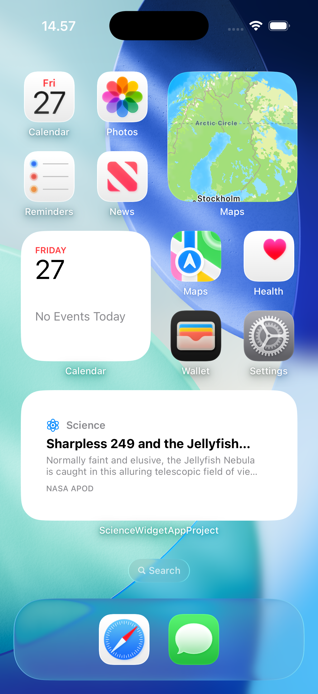
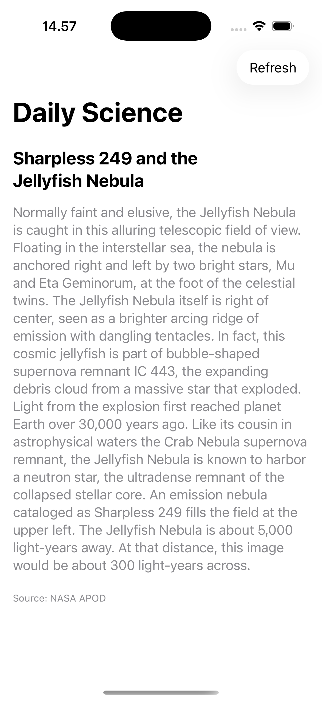

# TIL - Today I Learned: Daily Science Widget

My first application created by Cursor.

An iOS widget that displays one piece of science content every day on your phone's home screen.

## Project Status

✅ **MVP Implemented** - Small & medium widgets with NASA APOD integration

## Documentation

- **[PROJECT_PLAN.md](./PROJECT_PLAN.md)** - Comprehensive project plan, architecture, and implementation strategy
- **[QUICK_SETUP.md](./QUICK_SETUP.md)** - ⭐ **START HERE** - Step-by-step Xcode setup (Option 1)
- **[SETUP_CHECKLIST.md](./SETUP_CHECKLIST.md)** - Checklist to follow during setup
- **[SETUP_GUIDE.md](./SETUP_GUIDE.md)** - Detailed Xcode setup instructions
- **[GIT_WORKFLOW.md](./GIT_WORKFLOW.md)** - Git and GitHub workflow guide (which code to commit)

## Quick Overview

- **Platform**: iOS (WidgetKit)
- **Widget Type**: Medium widget (Phase 1), expandable to large
- **Data Source**: Free APIs or AI-generated content (TBD)
- **Development**: Cursor + Xcode

## Screenshots

| Medium widget | App view |
| --- | --- |
|  |  |

## Next Steps

1. Polish widget UI (fonts, truncation, spacing) for small and medium sizes.
2. Improve error handling and offline behavior when NASA is unreachable.
3. Optionally add secondary data sources or AI-generated fallback content.
4. Prepare for distribution (icons, app metadata, and App Store readiness).

